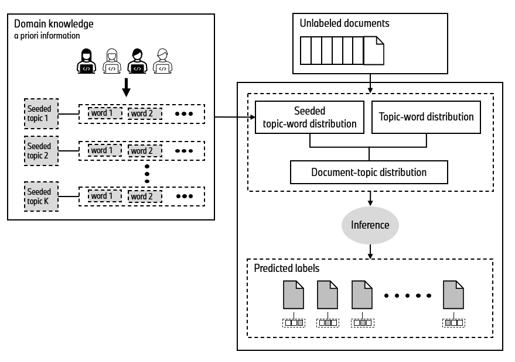

# Seeded Poisson Factorization

Source code for the paper: [Seeded Poisson Factorization: Leveraging domain knowledge to fit topic models](https://arxiv.org/abs/2503.02741).

This repo contains an easy to use implementation of the Seeded Poisson Factorization (SPF) topic model. SPF is a guided topic modeling approach that allows users to pre-specify topics of interest by providing sets of seed words. Built on Poisson factorization, it leverages variational inference techniques for efficient and scalable computation. 

<p>
    <div align="center">
        
    </div>
</p>


## Installation

The model works with **Python 3.10** or **Python 3.11**. The main dependencies are Tensorflow 2.18 and tensorflow_probability 0.25. 

> Please be sure to _adjust the dependencies if you are able to accelerate GPU support_.

### Via pip

SPF is available on [PyPI](https://pypi.org/project/seededPF/). The easiest way to install the model is via `pip`.

```{bash}
pip install seededpf
```

Afterwards, the SPF model can be imported:
```python
from seededpf import SPF
```


### From source
Configure a virtual environment using Pyhton 3.10 or Python 3.11. Inside the virtual environment, use `pip` to install the required packages:

```{bash}
(venv)$ pip install -r requirements.txt
```

## Data

We are using customer feedback from the Amazon dataset, available [here](https://www.kaggle.com/datasets/kashnitsky/hierarchical-text-classification). The dataset in this repo was already preprocessed. However, SPF can be applied to any corpus of text data.


## Applying SPF

To apply the SPF model, see [a minimal example](minimal_example.ipynb) or [an advanced example](analysis/examples/SPF_example_notebook.ipynb).


## Reproducing Paper Results

To reproduce our paper results please see [reproduction section](https://github.com/BPro2410/Seeded-Poisson-Factorization/tree/main/analysis/reproduction).